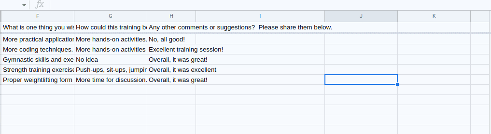

# GPTzero Counter Measure

This counter-measure uses GPTzero to analyze text for being created by an LLM. I made use of the same server used for the attack itself. This server makes use of suppress.js.

## How it works

Implement the following endpoint:

```js
server.app.get("/was/ai/:text", (req, res)=>{
    let text = req.params.text;
    request.post({
        url: "https://api.gptzero.me/v2/predict/text",
        headers: {
            "accept": "application/json",
            "Content-Type": "application/json"
        },
        body: JSON.stringify({
            "document": text
        })
    }, (err, response, body)=>{
        if(err){
            res.send(err);
        }else{
            // parse the response body
            let data = JSON.parse(body);
            let score = data.documents[0].completely_generated_prob
            res.send(`${score}`);
        }
    });

});
```

This endpoint will return a score between 0 and 1. The higher the score, the more likely it is that the text was generated by an LLM. The lower the score, the more likely it is that the text was written by a human.

## How to use
1. Start the server
2. `ngrok http 3000`
3. Copy the ngrok URL
4. In google sheets, create a new column and use the `CONCATENATE` function to create a string of all the response.
5. Use the `IMPORTDATA` function to import the data from the endpoint.

    ```=IMPORTDATA(CONCATENATE("https://<NGROK ID>.eu.ngrok.io","/was/ai/",ENCODEURL(<CELL BEFORE>)))```

6. Now you can expand both these new columns and see the scores for each response.


